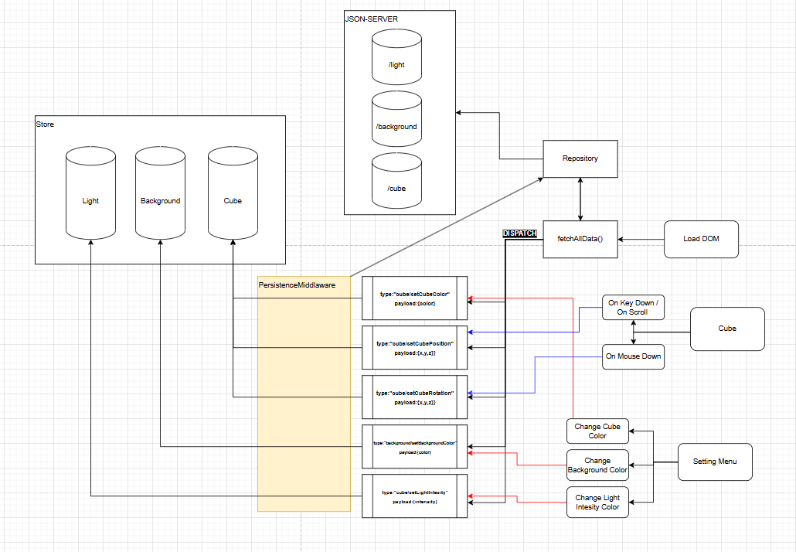

# DESAFIO TÉCNICO

## Tecnologias Utilizadas
- **TypeScript**: Proporciona tipagem estática e melhor organização do código.
- **Three.js**: Utilizado para renderização 3D e manipulação de objetos na cena.
- **Redux Toolkit**: Facilita o gerenciamento de estado global.
- **JSON Server**: Simula um backend para armazenar dados.
- **Webpack**: Empacotador de módulos para otimização do projeto.
- **Jest**: Framework para testes unitários e de integração.
- **TS-Loader e Webpack Dev Server**: Configurações para ambiente de desenvolvimento com TypeScript.

## Arquitetura do Projeto
O projeto segue uma arquitetura modular, com os seguintes diretórios principais:

- **core/**: Contém classes principais, como `Render`, `Cube`, `Controller` e `Light`.
- **redux/**: Contém `store.ts`, `sync.ts` e `persistenceMiddleware.ts` para gerenciamento de estado e persistência de dados.
- **ui/**: Responsável pela interação com a interface, através do `UIManager`.
- **data/**: Define o repositório para comunicação com a API fake (`JSON Server`).

## Fluxo de Dados e Comunicação com Backend


1. O Redux carrega os dados do backend através de `fetchAllData()` na inicialização.
2. O `CubeRepository` faz requisições aos endpoints do JSON Server.
3. O `persistenceMiddleware` monitora alterações no Redux e salva os dados automaticamente no backend.

### Endpoints Disponíveis
- `GET http://localhost:3000/cube` → Retorna a cor, posição e rotação do cubo.
- `GET http://localhost:3000/light` → Retorna a intensidade da luz.
- `GET http://localhost:3000/background` → Retorna a cor de fundo.
- `PUT http://localhost:3000/cube` → Atualiza as propriedades do cubo.
- `PUT http://localhost:3000/light` → Atualiza a intensidade da luz.
- `PUT http://localhost:3000/background` → Atualiza a cor de fundo.

## Como Executar
1. Instale as dependências:
   ```sh
   npm install
   ```
2. Inicie o servidor JSON:
   ```sh
   npm run server-json
   ```
3. Rode o ambiente de desenvolvimento:
   ```sh
   npm run dev
   ```

## Testes
Para rodar os testes de integração:
```sh
npm run test-server-json
npm run test
```
Isso iniciará o JSON Server em um ambiente de teste e executará os testes com Jest.
## Diferenciais
- Testes automatizados
- Projeto desenvolvido com a perspectiva de escalabilidade com um ambiente robusto e preparado para o aumento de complexidade
- Uso de CI/CD com github actions para facilitar o deploy
- Uso de TypeScript
- Uso de Redux como gerenciador global de estados
## Melhorias Futuras
- Tornar a aplicação mais robusta, considerando mais cenários para tratamento de erros.
- Aplicar técnicas como **injeção de dependências** para reduzir o acoplamento.
- Utilizar o padrão **singleton** para evitar múltiplas instâncias do `CubeRepository`, prevenindo inconsistências nos dados.
- Adicionar testes de integração mais abrangentes e aumentar a cobertura de testes para todos os módulos.
- Uso de containers
